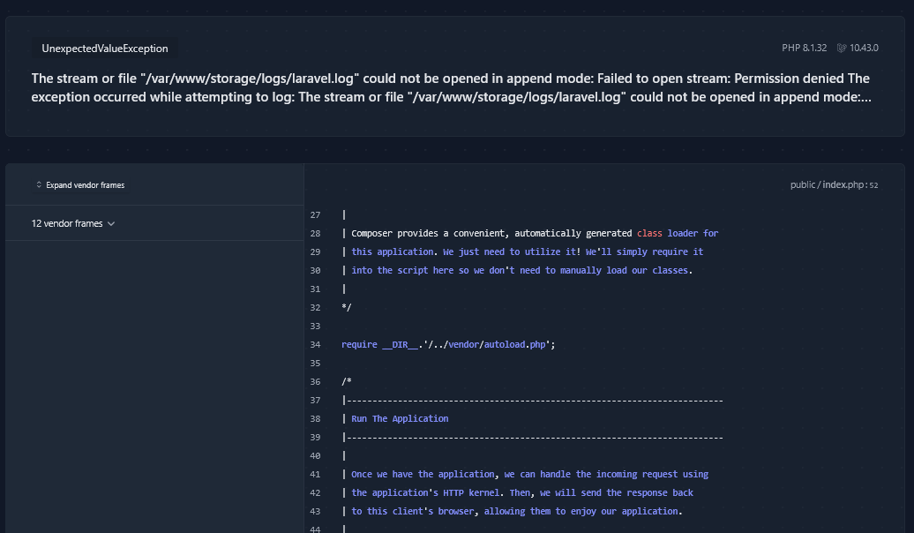

# POS KASIR (Template by Dewakoding Kasir)


This project is a simple Point of Sale (POS) or cashier application built using Laravel, Livewire 3, and Bootstrap.

## Table of Contents

- [Features](#features)
- [Installation](#installation)
- [Usage](#usage)

## Features

- Product management: Easily add, edit, and delete products.
- Sales transactions

## Installation

This project technically run with docker. So make sure the docker has been already installed on your computer.

1. Clone the repository:

    ```bash
    https://github.com/SeptiawanAjiP/dewakoding-kasir.git
    ```

2. Navigate to the project directory:

    ```bash
    cd your-project
    ```
3. Edit .env
    ```bash
    cp .env.example .env
    ```
    Change DATABASE
    ```bash
    DB_CONNECTION=mysql
    DB_HOST=db
    DB_PORT=3306
    DB_DATABASE=YOURDBNAME
    DB_USERNAME=YOURUSERNAME
    DB_PASSWORD=YOURPASSWORD
    ```

4. Run docker-compose / docker compose

    ```bash
    Running for the first time
    - sudo docker compose up -d --build
    or
    - sudo docker-compose up -d --build

    Running not at first time
    - sudo docker compose up -d
    or
    - sudo docker-compose up -d
    ```

4. Enter to container project app
    ```bash
    - sudo docker compose exec app bash
    or
    - sudo docker-compose exec app bash
    ```

5. Install PHP dependencies:

    ```bash
    composer install
    php artisan key:generate
    php artisan migrate:fresh --seed
    php artisan storage:link
    ```

### Usage

Visit `http://localhost:8000` in your browser to access the web-based landing page generator.

### Error Permission



If you have an error like this when run in the browser, run this command in your computer terminal (host), not in the container app : 

```bash
chmod -R 777 storage bootstrap/cache
```

### To do
- User Management (Login, Register)
- Role Management (Admin, User)
- Report Transaction each User
- Gmail Notification